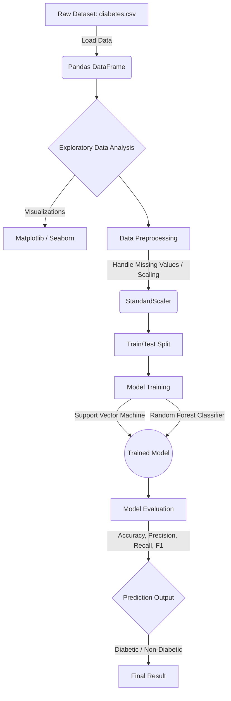

# MediStore Diabetes Prediction AI

## Project Overview
MediStore Diabetes Prediction is an AI-powered project designed to predict the likelihood of diabetes in patients based on various medical predictors. By leveraging machine learning algorithms on medical datasets, the project aims to assist healthcare professionals with early detection and risk assessment.

## Features
- **Predictive Modeling**: Utilizes robust machine learning models (like SVM, Random Forest) to accurately predict diabetes outcomes.
- **Data Visualization**: Includes visual exploratory data analysis (EDA) to understand feature distributions and correlations.
- **Interactive Notebook**: Provided as an easy-to-use Jupyter Notebook interface for seamless experimentation and tuning.

## Technologies Used
- **Language**: Python 3
- **Data Manipulation**: NumPy, Pandas
- **Machine Learning**: Scikit-Learn
- **Data Visualization**: Matplotlib, Seaborn, Plotly
- **Model Deployment/Saving**: Joblib, Streamlit

## Installation and Setup Instructions
1. **Clone the repository**:
   ```bash
   git clone https://github.com/SihanUdayaratna03/MediStore-Diabetes-Prediction-AI.git
   cd MediStore-Diabetes-Prediction-AI
   ```
2. **Create a virtual environment** (optional but recommended):
   ```bash
   python -m venv venv
   source venv/bin/activate  # On Windows use: venv\Scripts\activate
   ```
3. **Install dependencies**:
   ```bash
   pip install -r requirements.txt
   ```

## Architecture Diagram


## Project Structure
```text
MediStore Diabetes Prediction/
│
├── diabetes.csv                 # The raw dataset containing patient records
├── diabetes-prediction.ipynb    # Jupyter Notebook for EDA, preprocessing, and model training
├── requirements.txt             # Python package dependencies
├── .gitignore                   # Ignored files and folders
└── README.md                    # Project documentation
```

## Usage Guide
1. **Launch Jupyter Notebook**:
   ```bash
   jupyter notebook
   ```
2. **Open `diabetes-prediction.ipynb`**.
3. **Run the cells sequentially**:
   - The first few cells will import necessary libraries and load `diabetes.csv`.
   - Further cells will perform data preprocessing and normalization.
   - Run the training cells to train the `RandomForestClassifier` or `SVM` models.
   - The final cells evaluate the model and print out the accuracy, precision, and recall metrics.
4. **Custom Data**: If you wish to test custom data, format it identically to `diabetes.csv` and adjust the loading block in the notebook.
