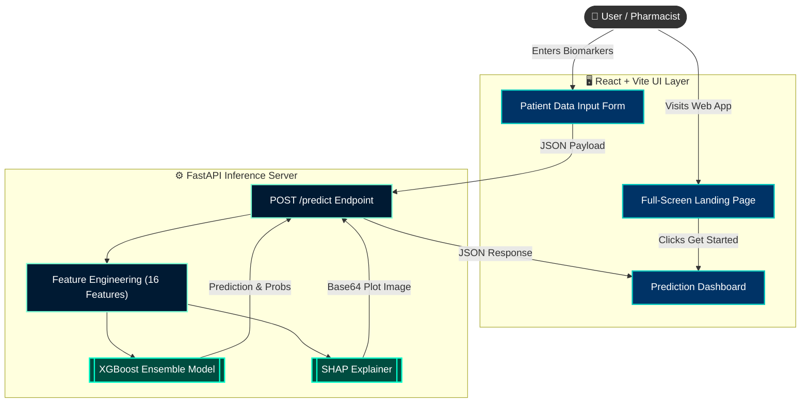

   #  MediStore AI - Diabetic Prediction System

  **A Clinical-Grade Machine Learning Tool for Diabetes Risk Assessment**
  
  [](https://python.org)
  [](https://fastapi.tiangolo.com)
  [](https://react.dev)
  [](https://scikit-learn.org)
</div>

<br>

## 🚀 Overview

**MediStore AI** is a professional, web application built to predict the likelihood of diabetes in patients using clinical biomarkers. 

Powered by an upgraded **XGBoost Ensemble model** and **Explainable AI (SHAP)**, it provides instant, highly accurate risk probabilities, detailed clinical analysis, and personalised health recommendations. Designed with a modern **Glassmorphism UI** aesthetic, the application seamlessly bridges the gap between powerful machine learning inference and an intuitive, pharmacist-friendly user experience.

---

## ✨ Key Features

- **🎨 Professional Glassmorphism UI:** Stunning, responsive React interface featuring transparent frosted-glass cards, dynamic full-screen backgrounds, and smooth animations.
- **⚡ Instant AI Prediction:** Real-time inference using a trained XGBoost Ensemble model (~85%+ accuracy).
- **🧠 Explainable AI (SHAP):** Visualise exactly how each biomarker influenced the AI's decision.
- **🔬 Clinical Biomarker Evaluation:** Dynamic identification of specific positive indicators and risk factors based on the patient's inputted data.
- **💡 Actionable Recommendations:** Tailored clinical and lifestyle recommendations based on the final prediction outcome.
- **🔒 100% Private & Local:** All inference runs locally. No patient data is sent to external APIs.

---

## 🏗️ System Architecture

The application has been upgraded to a robust modern web stack: a **Python/FastAPI** backend for heavy machine learning inference and a **React (Vite)** frontend for a seamless, interactive user experience.



---

## 🛠️ Tech Stack

- **Frontend:** React, Vite, Lucide-React, CSS (Custom Glassmorphism)
- **Backend:** FastAPI, Uvicorn, Python
- **Machine Learning:** XGBoost, Scikit-Learn
- **Explainable AI:** SHAP, Matplotlib
- **Data Manipulation:** NumPy, Pandas

---

## 📁 Project Structure

```
.
├── apps/streamlit/app.py        # Alternative Streamlit UI for the v2 model
├── backend/
│   ├── config.py                # Single source of truth for all artifact paths
│   ├── api/
│   │   ├── v2_server.py         # FastAPI · diabetes risk        · port 8000
│   │   └── v3_server.py         # FastAPI · complication risk    · port 8001
│   ├── ml/
│   │   ├── preprocessing_uci130.py
│   │   ├── train_v2.py          # Trains the v2 (PIMA) ensemble
│   │   ├── train_v3.py          # Trains the v3 (UCI-130) ensemble
│   │   └── verify_v3.py         # Sanity-checks the v3 artifacts
│   ├── rag/                     # Retrieval-augmented generation pipeline
│   └── data_ingestion/          # ChromaDB ingestion + raw_docs/ corpus
├── data/raw/                    # diabetes.csv, diabetic_data.csv
├── models/{v2,v3,legacy}/       # Trained .pkl artifacts + feature lists
├── notebooks/                   # Training / EDA notebooks
├── reports/figures/             # Generated EDA & SHAP plots
├── assets/images/               # Design assets
├── frontend/                    # React + Vite app
├── mcp_servers/                 # MCP stdio servers
└── scripts/start.ps1            # Starts both APIs + the frontend
```

All Python entry points are run as modules **from the project root**, so paths
resolve identically regardless of where you launch them.

---

## 💻 Local Setup & Installation

### Quick start (Windows)

```powershell
.\scripts\start.ps1
```

Starts both APIs and the frontend in separate windows. Or with Docker:

```bash
docker compose up --build
```

### Manual setup

**1. Install dependencies**

```bash
# On Windows:
.\venv\Scripts\activate
# On macOS/Linux:
# source venv/bin/activate

pip install -r requirements.txt          # API + Streamlit runtime
pip install -r requirements_uci130.txt   # v3 training / SHAP
pip install -r requirements_rag.txt      # optional: RAG + MCP stack
```

**2. Start the backends** — run each from the **project root**:

```bash
uvicorn backend.api.v2_server:app --reload --port 8000   # diabetes risk
uvicorn backend.api.v3_server:app --reload --port 8001   # complication risk
```

**3. Start the React frontend**

```bash
cd frontend
npm install     # first time only
npm run dev
```

The app is live at **`http://localhost:5173`**.

The frontend reads its API base URLs from `VITE_API_V2_URL` / `VITE_API_V3_URL`,
defaulting to the localhost ports above.

### Optional: Streamlit UI

```bash
streamlit run apps/streamlit/app.py
```

### Optional: RAG knowledge base

```bash
cp .env.example .env    # then add your GOOGLE_API_KEY
python -m backend.data_ingestion.ingest
```

---

## 🔄 Retraining

```bash
python -m backend.ml.train_v2   # → models/v2/
python -m backend.ml.train_v3   # → models/v3/
python -m backend.ml.verify_v3  # sanity-check the v3 artifacts
```

Plots are written to `reports/figures/`.

---

## 🩺 Dataset & Model Details

### Model v2 — Diabetes Risk Predictor (PIMA Dataset)

The v2 model was trained using a custom engineered pipeline with SMOTE balancing. It expands the original 8 biomarkers into **16 engineered features** for higher precision:
1. **Base Features:** Pregnancies, Glucose, Blood Pressure, Skin Thickness, Insulin, BMI, Diabetes Pedigree Function, Age
2. **Engineered Features:** Glucose_BMI_Ratio, Insulin_Resistance, Age_BMI_Interaction, BP_Age_Risk, Glucose_Category, BMI_Category, Age_Category, Metabolic_Syndrome_Risk

**Model Performance:** ~85%+ Accuracy (XGBoost Ensemble).

---

## 🏥 Model v3 — Diabetes Complication Risk Predictor (UCI-130)

A second, independent model trained on the **UCI Diabetes 130-US Hospitals dataset ** with **101,767 real patient records** to predict the risk of early hospital readmission (within 30 days) for diabetic patients.

### Architecture

```
Input (101,767 patient records)
        │
        ▼
┌─────────────────────────────────┐
│        Data Preprocessing       │
│  - Drop high-missing columns    │
│  - Encode age brackets          │
│  - Map A1C & glucose results    │
│  - Map medication changes       │
│  - ICD-9 diagnosis grouping     │
└────────────────┬────────────────┘
                 │
                 ▼
┌─────────────────────────────────┐
│         SMOTE Balancing         │
│  Oversample minority class      │
│  (<30 day readmissions)         │
└────────────────┬────────────────┘
                 │
                 ▼
┌──────────────────────────────────────────────┐
│         Soft-Voting Ensemble (v3)            │
│                                              │
│   XGBoost (weight: 2)                        │
│   + LightGBM (weight: 2)                     │
│   + Random Forest (weight: 1)                │
│                                              │
│   Final prediction = weighted probability    │
└────────────────┬─────────────────────────────┘
                 │
                 ▼
┌─────────────────────────────────┐
│       SHAP Explainability       │
│  Per-prediction feature impact  │
│  Beeswarm, waterfall, bar plots │
└─────────────────────────────────┘
```

### Features Used (v3)

| Category | Features |
|---|---|
| Demographics | Age bracket, Gender, Race |
| Admission Info | Admission type, Discharge disposition, Admission source |
| Clinical | Time in hospital, Number of diagnoses, Number of lab procedures |
| Lab Results | A1C result, Max glucose serum |
| Medications | Insulin, Metformin, and 21 other medication change flags |
| Diagnosis | Primary ICD-9 code group (diag_1) |

### Target Variable

Binary classification:
- `1` → Patient **readmitted within 30 days** (high risk)
- `0` → Not readmitted within 30 days (low risk)

### Model Artifacts

| File | Description |
|---|---|
| `models/v3/diabetes_model_v3.pkl` | Trained soft-voting ensemble classifier |
| `models/v3/scaler_v3.pkl` | StandardScaler fitted on training data |
| `models/v3/feature_names_v3.json` | Ordered list of input features |
| `models/v3/shap_explainer_v3.pkl` | SHAP TreeExplainer for model interpretability |

### Training Scripts

| File | Purpose |
|---|---|
| `notebooks/diabetes_complication_risk_predictor.ipynb` | Full interactive training notebook |
| `backend/ml/train_v3.py` | Standalone training script |
| `backend/ml/preprocessing_uci130.py` | UCI-130 specific preprocessing pipeline |
| `backend/ml/verify_v3.py` | Artifact integrity and prediction verification |
| `requirements_uci130.txt` | Dependencies for v3 training |

---

> **⚠️ Medical Disclaimer**  
> *This software is for educational and demonstrative purposes only. It is not intended to be a substitute for professional medical advice, diagnosis, or treatment. Always seek the advice of a qualified health provider with any questions regarding a medical condition.*
