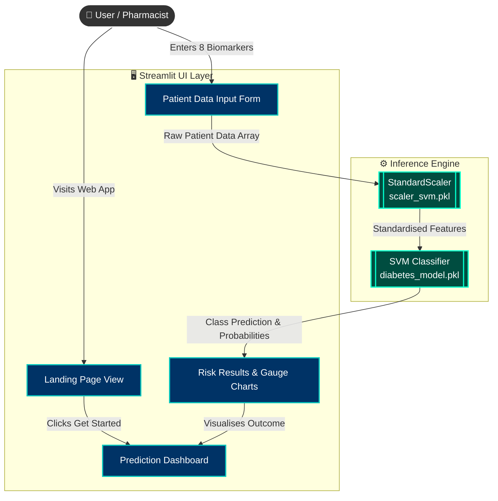

  # 💊 MediStore AI - Diabetic Prediction System

  **A Clinical-Grade Machine Learning Tool for Diabetes Risk Assessment**
  
  [](https://python.org)
  [](https://streamlit.io)
  [](https://scikit-learn.org)
</div>

<br>

## 🚀 Overview

**MediStore AI** is a professional, beautifully designed web application built to predict the likelihood of diabetes in patients using clinical biomarkers. Powered by a Support Vector Machine (SVM) algorithm, it provides instant, highly accurate risk probabilities, detailed clinical analysis, and personalised health recommendations.

Designed with a modern **Glassmorphism UI** aesthetic, the application seamlessly bridges the gap between powerful machine learning inference and an intuitive, pharmacist-friendly user experience.

---

## ✨ Key Features

- **🎨 Professional Glassmorphism UI:** Stunning, responsive interface featuring transparent frosted-glass cards, dynamic gradient overlays, and a custom CSS framework.
- **⚡ Instant AI Prediction:** Real-time inference using a trained SVM model.
- **📊 Comprehensive Risk Analysis:** Detailed probability breakdowns with visual risk gauge charts (powered by Plotly).
- **🔬 Clinical Biomarker Evaluation:** Dynamic identification of specific positive indicators and risk factors based on the patient's inputted data.
- **💡 Actionable Recommendations:** Tailored clinical and lifestyle recommendations based on the final prediction outcome.
- **🔒 100% Private & Local:** All inference runs locally in the browser/server. No patient data is sent to external APIs.

---

## 🏗️ System Architecture

The application follows a streamlined, single-page architecture built entirely in Python using Streamlit, seamlessly handling both the frontend presentation and backend model inference.



---

## 🛠️ Tech Stack

- **Frontend & Routing:** [Streamlit](https://streamlit.io/) (with heavy custom CSS injection)
- **Machine Learning:** [Scikit-Learn](https://scikit-learn.org/) (SVM, StandardScaler)
- **Data Visualisation:** [Plotly](https://plotly.com/) (Gauge Charts)
- **Data Manipulation:** [NumPy](https://numpy.org/), [Pandas](https://pandas.pydata.org/)
- **Model Serialisation:** Joblib

---

## 💻 Local Setup & Installation

Follow these steps to run MediStore AI locally on your machine.

**1. Clone the repository**
```bash
git clone https://github.com/SihanUdayaratna03/MediStore-Diabetes-Prediction-AI.git
cd MediStore-Diabetes-Prediction-AI
```

**2. Create a virtual environment (recommended)**
```bash
python -m venv venv
# On Windows:
venv\Scripts\activate
# On macOS/Linux:
source venv/bin/activate
```

**3. Install dependencies**
```bash
pip install -r requirements.txt
```
*(Ensure you have `streamlit`, `scikit-learn`, `numpy`, `pandas`, and `plotly` installed).*

**4. Run the application**
```bash
streamlit run app.py
```

The application will launch in your default web browser at `http://localhost:8501`.

---

## 🩺 Dataset & Model Details

The model was trained on the **Pima Indians Diabetes Database** (768 patient records). 
The following 8 clinical biomarkers are required for prediction:
1. **Pregnancies:** Number of times pregnant
2. **Glucose:** Plasma glucose concentration (2 hours in an oral glucose tolerance test)
3. **Blood Pressure:** Diastolic blood pressure (mm Hg)
4. **Skin Thickness:** Triceps skin fold thickness (mm)
5. **Insulin:** 2-Hour serum insulin (mu U/ml)
6. **BMI:** Body mass index (weight in kg/(height in m)^2)
7. **Diabetes Pedigree Function:** Genetic predisposition score
8. **Age:** Years

**Model Performance:** ~78% Accuracy on test splits.

---

> **⚠️ Medical Disclaimer**  
> *This software is for educational and demonstrative purposes only. It is not intended to be a substitute for professional medical advice, diagnosis, or treatment. Always seek the advice of a qualified health provider with any questions regarding a medical condition.*
