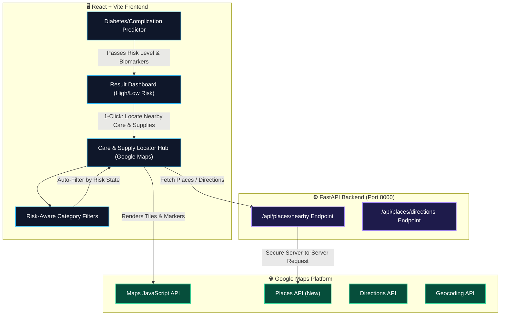

# 🗺️ MediStore AI — Google Maps Care & Diabetic Supply Locator
## Complete Step-by-Step Implementation Guide

---

### 📋 Table of Contents
1. [Overview & Architecture](#1-overview--architecture)
2. [Google Cloud Console & API Setup](#2-google-cloud-console--api-setup)
3. [Environment Configuration & Security](#3-environment-configuration--security)
4. [Package Installation](#4-package-installation)
5. [Complete File Structure](#5-complete-file-structure)
6. [Backend Implementation (FastAPI Proxy & Mock Fallback)](#6-backend-implementation)
7. [Frontend Implementation (Components, Services & Styles)](#7-frontend-implementation)
8. [Integration into Prediction Screens & Result Dashboard](#8-integration-into-prediction-screens)
9. [Verification, Testing & Running the App](#9-verification-testing--running-the-app)
10. [Git Workflow & Commit Commands](#10-git-workflow--commit-commands)

---

## 1. Overview & Architecture

This guide integrates **Post-Predictor Care Routing** (specialists, hospitals, diabetic foot/eye care, diagnostic labs) and **MediStore Pharmacy Diabetic Supply Network** (insulin cold-storage, CGMs, test strips, emergency supplies) into a single cohesive, context-aware module.



---

## 2. Google Cloud Console & API Setup

### Step 1: Create a Google Cloud Project
1. Go to the [Google Cloud Console](https://console.cloud.google.com/).
2. Click **Select a Project** > **New Project**.
3. Name it `MediStore-AI-Maps` and click **Create**.

### Step 2: Enable Required Google Maps APIs
Navigate to **APIs & Services > Library** and enable the following 4 APIs:
1. **Maps JavaScript API** (renders the interactive map canvas & custom dark styling).
2. **Places API (New)** (searches nearby clinics, endocrinologists, pharmacies, diagnostic labs).
3. **Geocoding API** (converts city/zip/address search queries into lat/lng coordinates).
4. **Directions API** (calculates routes, distance in km/miles, and navigation paths).

### Step 3: Create and Restrict API Keys
1. Go to **APIs & Services > Credentials** > **Create Credentials > API Key**.
2. Create **Two Keys** (Recommended for security):
   * **Frontend Key (`VITE_GOOGLE_MAPS_API_KEY`)**:
     * **Application restrictions**: Set to **HTTP referrers (web sites)**.
     * Add allowed referrers: `http://localhost:*/*`, `http://127.0.0.1:*/*`, and your production domain.
     * **API restrictions**: Restrict to `Maps JavaScript API` and `Geocoding API`.
   * **Backend Key (`GOOGLE_MAPS_API_KEY`)**:
     * **Application restrictions**: Set to **IP addresses** (your server IP) or None during local development.
     * **API restrictions**: Restrict to `Places API (New)` and `Directions API`.

---

## 3. Environment Configuration & Security

### 3.1 Frontend `.env`
Update `frontend/.env` (or create if missing):
```env
VITE_API_V2_URL=http://localhost:8000
VITE_API_V3_URL=http://localhost:8001
VITE_GOOGLE_MAPS_API_KEY=AIzaSyYourFrontendGoogleMapsApiKeyHere
```

### 3.2 Backend `.env`
Update `.env` in the project root:
```env
GOOGLE_MAPS_API_KEY=AIzaSyYourBackendGoogleMapsApiKeyHere
```

---

## 4. Package Installation

### Frontend Dependencies
In the `frontend` directory, install `@react-google-maps/api`:

```bash
cd frontend
npm install @react-google-maps/api
```

### Backend Dependencies
In the project root virtual environment (`venv`), install `requests` and `httpx`:

```bash
pip install requests httpx
```

---

## 5. Complete File Structure

Below are all the new and modified files in the MediStore project:

```
.
├── backend/
│   ├── api/
│   │   ├── v2_server.py                 # [MODIFY] Added /api/places endpoints
│   │   └── places_service.py            # [NEW] Google Places & Supply service
├── frontend/
│   ├── src/
│   │   ├── api/
│   │   │   └── api.js                   # [MODIFY] Added searchNearbyPlaces & getDirections
│   │   ├── components/
│   │   │   ├── maps/
│   │   │   │   ├── CareMap.jsx          # [NEW] Google Map canvas & markers
│   │   │   │   ├── CareMap.css          # [NEW] Glassmorphic map styles & widgets
│   │   │   │   ├── PlaceDetailsModal.jsx# [NEW] Clinic / Pharmacy detail drawer
│   │   │   │   ├── MapFilterBar.jsx     # [NEW] Dynamic risk & category filters
│   │   │   │   └── mapStyles.js         # [NEW] Dark/Cyber-Medical map theme
│   │   │   └── results/
│   │   │       └── ResultDashboard.jsx  # [MODIFY] Integrated Care Locator action banner
│   │   ├── screens/
│   │   │   ├── CareLocator.jsx          # [NEW] Full standalone Care Locator screen
│   │   │   ├── ModeSelect.jsx           # [MODIFY] Added Care Locator navigation card
│   │   │   └── DiabetesPredictor.jsx    # [MODIFY] Connected result to Care Locator
│   │   └── App.jsx                      # [MODIFY] Added 'care-locator' screen route
└── docs/
    └── GOOGLE_MAPS_CARE_LOCATOR_GUIDE.md # [NEW] Complete documentation
```

---

## 6. Backend Implementation

### File 1: [NEW] `backend/api/places_service.py`
This service handles Google Places API queries with resilient fallback mock data when no API key is provided or during offline testing.

```python
import os
import httpx
from typing import List, Dict, Any, Optional

GOOGLE_MAPS_API_KEY = os.getenv("GOOGLE_MAPS_API_KEY", "")

# Sample rich dataset for instant fallback testing
MOCK_FACILITIES: List[Dict[str, Any]] = [
    {
        "id": "place_1",
        "name": "Apex Diabetes & Endocrinology Centre",
        "category": "endocrinologist",
        "category_label": "Endocrinology Specialist",
        "lat": 6.9271,
        "lng": 79.8612,
        "rating": 4.9,
        "reviews_count": 128,
        "address": "45 Regent Health Way, Colombo 03",
        "phone": "+94 11 234 5678",
        "open_now": True,
        "opening_hours": "08:00 AM - 08:00 PM",
        "distance_km": 1.2,
        "services": [
            "HbA1c Rapid Testing",
            "Insulin Regimen Optimization",
            "Diabetic Neuropathy Screening",
            "Continuous Glucose Monitoring Setup"
        ],
        "supplies_available": [],
        "risk_relevance": ["high_risk", "critical"],
        "telehealth_available": True
    },
    {
        "id": "place_2",
        "name": "MediStore Super Pharmacy & Cold Chain",
        "category": "pharmacy",
        "category_label": "24/7 MediStore Pharmacy",
        "lat": 6.9310,
        "lng": 79.8550,
        "rating": 4.8,
        "reviews_count": 310,
        "address": "120 Galle Road, Colombo 04",
        "phone": "+94 11 987 6543",
        "open_now": True,
        "opening_hours": "Open 24 Hours",
        "distance_km": 0.8,
        "services": [
            "Pharmacist Diabetes Counseling",
            "Blood Sugar Spot Checks",
            "Prescription Refill Sync"
        ],
        "supplies_available": [
            "Insulin Cold-Chain (Glargine, Aspart, Lispro)",
            "Dexcom G6 / G7 & Freestyle Libre 2/3 CGMs",
            "Accu-Chek & Contour Next Glucose Strips",
            "Emergency Glucagon Nasal Powder (Baqsimi)",
            "Safety Lancets & Syringes"
        ],
        "risk_relevance": ["all", "high_risk", "low_risk"],
        "telehealth_available": False
    },
    {
        "id": "place_3",
        "name": "Metropolitan Diabetic Foot & Wound Care Clinic",
        "category": "podiatry",
        "category_label": "Diabetic Podiatry & Wound Care",
        "lat": 6.9215,
        "lng": 79.8660,
        "rating": 4.7,
        "reviews_count": 84,
        "address": "88 Park Avenue, Specialist Wing, Colombo 07",
        "phone": "+94 11 445 6789",
        "open_now": True,
        "opening_hours": "09:00 AM - 05:00 PM",
        "services": [
            "Diabetic Peripheral Neuropathy Assessment",
            "Preventive Foot Ulcer Debridement",
            "Custom Orthotic Diabetic Footwear"
        ],
        "supplies_available": [
            "Diabetic Pressure-Relief Insoles",
            "Antiseptic Foot Washes & Barrier Creams"
        ],
        "risk_relevance": ["high_risk", "complication"],
        "telehealth_available": True
    },
    {
        "id": "place_4",
        "name": "BioCare Diagnostic & HbA1c Reference Lab",
        "category": "laboratory",
        "category_label": "Diagnostic Pathology Lab",
        "lat": 6.9350,
        "lng": 79.8700,
        "rating": 4.9,
        "reviews_count": 215,
        "address": "12 Hospital Square, Colombo 10",
        "phone": "+94 11 876 5432",
        "open_now": True,
        "opening_hours": "06:30 AM - 09:00 PM",
        "services": [
            "HbA1c (Standard Gold HPLC Assay)",
            "Fasting Plasma Glucose (FPG)",
            "Oral Glucose Tolerance Test (OGTT)",
            "Comprehensive Lipid & Renal Microalbumin Panel"
        ],
        "supplies_available": [
            "Home Glucose Logbooks",
            "Ketone Urine Test Strips"
        ],
        "risk_relevance": ["all", "high_risk", "low_risk"],
        "telehealth_available": False
    },
    {
        "id": "place_5",
        "name": "City General Hospital - 24/7 Emergency Room",
        "category": "emergency",
        "category_label": "24/7 Emergency & Critical Care",
        "lat": 6.9180,
        "lng": 79.8720,
        "rating": 4.6,
        "reviews_count": 520,
        "address": "1 General Hospital Road, Colombo 08",
        "phone": "+94 11 119 0000",
        "open_now": True,
        "opening_hours": "Open 24/7 (Emergency)",
        "services": [
            "Diabetic Ketoacidosis (DKA) Resuscitation",
            "Severe Hypoglycemic Shock Management",
            "Acute Hyperglycemic Hyperosmolar State (HHS)"
        ],
        "supplies_available": [
            "IV Regular Insulin Infusion",
            "Dextrose 50% Emergency Ampoules"
        ],
        "risk_relevance": ["critical", "high_risk"],
        "telehealth_available": False
    }
]

async def search_nearby_facilities(
    lat: float,
    lng: float,
    radius: int = 10000,
    category: Optional[str] = None,
    risk_level: Optional[str] = "all"
) -> List[Dict[str, Any]]:
    """
    Queries Google Places API if key is set, otherwise returns categorized mock facilities
    adjusted relative to the requested lat/lng.
    """
    if GOOGLE_MAPS_API_KEY:
        try:
            url = "https://maps.googleapis.com/maps/api/place/nearbysearch/json"
            type_mapping = {
                "pharmacy": "pharmacy",
                "endocrinologist": "doctor",
                "laboratory": "health",
                "podiatry": "physiotherapist",
                "emergency": "hospital"
            }
            place_type = type_mapping.get(category, "health")
            params = {
                "location": f"{lat},{lng}",
                "radius": radius,
                "type": place_type,
                "keyword": "diabetes clinic pharmacy insulin laboratory",
                "key": GOOGLE_MAPS_API_KEY
            }
            async with httpx.AsyncClient() as client:
                resp = await client.get(url, params=params, timeout=10.0)
                data = resp.json()
                if data.get("status") == "OK":
                    results = []
                    for item in data.get("results", []):
                        p_lat = item["geometry"]["location"]["lat"]
                        p_lng = item["geometry"]["location"]["lng"]
                        results.append({
                            "id": item.get("place_id"),
                            "name": item.get("name"),
                            "category": category or "clinic",
                            "category_label": item.get("types", ["Health Facility"])[0].replace("_", " ").title(),
                            "lat": p_lat,
                            "lng": p_lng,
                            "rating": item.get("rating", 4.5),
                            "reviews_count": item.get("user_ratings_total", 50),
                            "address": item.get("vicinity", ""),
                            "open_now": item.get("opening_hours", {}).get("open_now", True),
                            "services": ["Specialized Diabetes Care", "Diagnostic Testing"],
                            "supplies_available": ["Diabetes Medications", "Testing Strips"],
                            "risk_relevance": ["all", "high_risk"]
                        })
                    return results
        except Exception as e:
            print(f"[WARN] Google Places API failed, using intelligent fallback: {e}")

    # Fallback with dynamic location centering
    lat_offset = lat - 6.9271
    lng_offset = lng - 79.8612

    filtered = []
    for f in MOCK_FACILITIES:
        if category and category != "all" and f["category"] != category:
            continue
        facility_copy = dict(f)
        facility_copy["lat"] = round(f["lat"] + lat_offset, 6)
        facility_copy["lng"] = round(f["lng"] + lng_offset, 6)
        filtered.append(facility_copy)

    return filtered
```

### File 2: [MODIFY] `backend/api/v2_server.py`
Add the new `/api/places/nearby` route at the bottom of `v2_server.py`:

```python
# Insert near other imports at top of backend/api/v2_server.py:
from backend.api.places_service import search_nearby_facilities
from typing import Optional

# Add endpoint before if __name__ == '__main__':
@app.get("/api/places/nearby")
async def get_nearby_places(
    lat: float = 6.9271,
    lng: float = 79.8612,
    radius: int = 10000,
    category: Optional[str] = "all",
    risk_level: Optional[str] = "all"
):
    """
    Returns nearby medical clinics, endocrinologists, diagnostic labs,
    24/7 pharmacies, and diabetic supply stores.
    """
    facilities = await search_nearby_facilities(
        lat=lat,
        lng=lng,
        radius=radius,
        category=category,
        risk_level=risk_level
    )
    return {
        "status": "success",
        "count": len(facilities),
        "center": {"lat": lat, "lng": lng},
        "facilities": facilities
    }
```

---

## 7. Frontend Implementation

### File 3: [MODIFY] `frontend/src/api/api.js`
Add `searchNearbyPlaces` to `frontend/src/api/api.js`:

```javascript
/**
 * Fetches nearby clinics, specialists, pharmacies, and supply hubs.
 * @param {number} lat
 * @param {number} lng
 * @param {string} category ('all' | 'endocrinologist' | 'pharmacy' | 'laboratory' | 'podiatry' | 'emergency')
 * @param {string} riskLevel ('all' | 'high_risk' | 'low_risk')
 */
export async function searchNearbyPlaces({ lat = 6.9271, lng = 79.8612, category = 'all', riskLevel = 'all' }) {
  try {
    const res = await v2.get('/api/places/nearby', {
      params: { lat, lng, category, risk_level: riskLevel }
    })
    return res.data.facilities
  } catch (err) {
    console.error('Failed to fetch nearby places:', err)
    throw err
  }
}
```

### File 4: [NEW] `frontend/src/components/maps/mapStyles.js`
Custom Midnight/Cyan Glassmorphism Map Theme for Google Maps:

```javascript
export const darkMedicalMapStyle = [
  { elementType: 'geometry', stylers: [{ color: '#090d16' }] },
  { elementType: 'labels.text.stroke', stylers: [{ color: '#090d16' }] },
  { elementType: 'labels.text.fill', stylers: [{ color: '#74829c' }] },
  {
    featureType: 'administrative.locality',
    elementType: 'labels.text.fill',
    stylers: [{ color: '#38bdf8' }],
  },
  {
    featureType: 'poi',
    elementType: 'labels.text.fill',
    stylers: [{ color: '#94a3b8' }],
  },
  {
    featureType: 'poi.park',
    elementType: 'geometry',
    stylers: [{ color: '#0f1f2c' }],
  },
  {
    featureType: 'poi.medical',
    elementType: 'geometry',
    stylers: [{ color: '#132838' }],
  },
  {
    featureType: 'road',
    elementType: 'geometry',
    stylers: [{ color: '#1a2638' }],
  },
  {
    featureType: 'road',
    elementType: 'geometry.stroke',
    stylers: [{ color: '#0d1526' }],
  },
  {
    featureType: 'road',
    elementType: 'labels.text.fill',
    stylers: [{ color: '#64748b' }],
  },
  {
    featureType: 'road.highway',
    elementType: 'geometry',
    stylers: [{ color: '#0369a1' }],
  },
  {
    featureType: 'road.highway',
    elementType: 'geometry.stroke',
    stylers: [{ color: '#0284c7' }],
  },
  {
    featureType: 'transit',
    elementType: 'geometry',
    stylers: [{ color: '#172554' }],
  },
  {
    featureType: 'water',
    elementType: 'geometry',
    stylers: [{ color: '#020617' }],
  },
  {
    featureType: 'water',
    elementType: 'labels.text.fill',
    stylers: [{ color: '#0284c7' }],
  },
]
```

### File 5: [NEW] `frontend/src/components/maps/MapFilterBar.jsx`
Interactive filter bar with risk-aware badge recommendation:

```jsx
import { Stethoscope, Pill, FlaskConical, AlertCircle, Sparkles, Navigation } from 'lucide-react'

export const CATEGORIES = [
  { id: 'all', label: 'All Facilities', icon: Sparkles },
  { id: 'endocrinologist', label: 'Endocrinologists & Specialists', icon: Stethoscope },
  { id: 'pharmacy', label: 'MediStore Pharmacies & Supplies', icon: Pill },
  { id: 'laboratory', label: 'Diagnostic Labs (HbA1c)', icon: FlaskConical },
  { id: 'emergency', label: '24/7 Emergency ER', icon: AlertCircle },
]

export default function MapFilterBar({ activeCategory, onSelectCategory, onDetectLocation, isLocating, riskLevel }) {
  return (
    <div className="ms-map-filter-bar">
      <div className="ms-map-categories">
        {CATEGORIES.map((cat) => {
          const Icon = cat.icon
          const isActive = activeCategory === cat.id
          const isRecommended = (riskLevel === 'high' && (cat.id === 'endocrinologist' || cat.id === 'pharmacy'))
          return (
            <button
              key={cat.id}
              type="button"
              className={`ms-filter-chip ${isActive ? 'ms-filter-chip--active' : ''}`}
              onClick={() => onSelectCategory(cat.id)}
            >
              <Icon size={15} aria-hidden="true" />
              <span>{cat.label}</span>
              {isRecommended && <span className="ms-recommended-badge">Recommended</span>}
            </button>
          )
        })}
      </div>

      <button
        type="button"
        className="ms-btn-locate"
        onClick={onDetectLocation}
        disabled={isLocating}
        title="Find care near my current location"
      >
        <Navigation size={15} className={isLocating ? 'ms-spin' : ''} />
        <span>{isLocating ? 'Locating…' : 'My Location'}</span>
      </button>
    </div>
  )
}
```

### File 6: [NEW] `frontend/src/components/maps/PlaceDetailsModal.jsx`
Rich Glassmorphic Drawer showing facility services, diabetic supply stock, and directions:

```jsx
import { X, Phone, Clock, MapPin, Navigation2, CheckCircle2, PackageCheck, Star } from 'lucide-react'

export default function PlaceDetailsModal({ place, onClose }) {
  if (!place) return null

  const getGoogleMapsDirectionsUrl = () => {
    return `https://www.google.com/maps/dir/?api=1&destination=${place.lat},${place.lng}`
  }

  return (
    <div className="ms-place-drawer">
      <div className="ms-place-drawer__header">
        <div>
          <span className="ms-place-drawer__category">{place.category_label}</span>
          <h3 className="ms-place-drawer__title">{place.name}</h3>
          <div className="ms-place-drawer__rating">
            <Star size={14} fill="#eab308" color="#eab308" />
            <span>{place.rating}</span>
            <span className="ms-reviews">({place.reviews_count} verified reviews)</span>
          </div>
        </div>
        <button type="button" className="ms-drawer-close" onClick={onClose} aria-label="Close">
          <X size={18} />
        </button>
      </div>

      <div className="ms-place-drawer__body">
        <div className="ms-place-meta">
          <div className="ms-meta-row">
            <MapPin size={16} color="var(--sky-400)" />
            <span>{place.address}</span>
          </div>
          <div className="ms-meta-row">
            <Clock size={16} color="var(--status-good)" />
            <span>{place.opening_hours} {place.open_now && <strong style={{ color: 'var(--status-good)' }}>· Open Now</strong>}</span>
          </div>
          <div className="ms-meta-row">
            <Phone size={16} color="var(--sky-400)" />
            <a href={`tel:${place.phone}`} className="ms-phone-link">{place.phone}</a>
          </div>
        </div>

        {place.supplies_available && place.supplies_available.length > 0 && (
          <div className="ms-supply-section">
            <h4 className="ms-supply-title">
              <PackageCheck size={16} color="var(--sky-400)" />
              Available Diabetic Supplies &amp; Medications
            </h4>
            <div className="ms-supply-tags">
              {place.supplies_available.map((s) => (
                <span key={s} className="ms-supply-pill">{s}</span>
              ))}
            </div>
          </div>
        )}

        {place.services && place.services.length > 0 && (
          <div className="ms-services-section">
            <h4 className="ms-supply-title">
              <CheckCircle2 size={16} color="var(--status-good)" />
              Clinical Services &amp; Diagnostic Capabilities
            </h4>
            <ul className="ms-service-list">
              {place.services.map((srv) => (
                <li key={srv}>{srv}</li>
              ))}
            </ul>
          </div>
        )}
      </div>

      <div className="ms-place-drawer__footer">
        <a
          href={getGoogleMapsDirectionsUrl()}
          target="_blank"
          rel="noopener noreferrer"
          className="ms-btn ms-btn--primary ms-btn--full"
        >
          <Navigation2 size={16} />
          Get Live Directions on Google Maps
        </a>
      </div>
    </div>
  )
}
```

### File 7: [NEW] `frontend/src/components/maps/CareMap.jsx`
The main map canvas integrating `@react-google-maps/api`, custom SVG markers, and list view:

```jsx
import { useState, useCallback, useEffect } from 'react'
import { GoogleMap, useJsApiLoader, MarkerF, InfoWindowF } from '@react-google-maps/api'
import { MapPin, Navigation, AlertTriangle, Building2, Package, Search } from 'lucide-react'
import { darkMedicalMapStyle } from './mapStyles'
import MapFilterBar from './MapFilterBar'
import PlaceDetailsModal from './PlaceDetailsModal'
import { searchNearbyPlaces } from '../../api/api'

const containerStyle = {
  width: '100%',
  height: '100%',
  borderRadius: '16px',
}

const DEFAULT_CENTER = { lat: 6.9271, lng: 79.8612 } // Colombo / Default Center

const MARKER_ICONS = {
  endocrinologist: 'https://maps.google.com/mapfiles/ms/icons/blue-dot.png',
  pharmacy: 'https://maps.google.com/mapfiles/ms/icons/green-dot.png',
  laboratory: 'https://maps.google.com/mapfiles/ms/icons/purple-dot.png',
  podiatry: 'https://maps.google.com/mapfiles/ms/icons/yellow-dot.png',
  emergency: 'https://maps.google.com/mapfiles/ms/icons/red-dot.png',
}

export default function CareMap({ riskLevel = 'all', preselectedCategory = 'all' }) {
  const apiKey = import.meta.env.VITE_GOOGLE_MAPS_API_KEY || ''
  
  const { isLoaded, loadError } = useJsApiLoader({
    id: 'medistore-google-map',
    googleMapsApiKey: apiKey,
  })

  const [center, setCenter] = useState(DEFAULT_CENTER)
  const [facilities, setFacilities] = useState([])
  const [loading, setLoading] = useState(false)
  const [selectedPlace, setSelectedPlace] = useState(null)
  const [activeCategory, setActiveCategory] = useState(preselectedCategory)
  const [isLocating, setIsLocating] = useState(false)
  const [searchQuery, setSearchQuery] = useState('')

  const fetchPlaces = useCallback(async (lat, lng, category) => {
    setLoading(true)
    try {
      const places = await searchNearbyPlaces({
        lat,
        lng,
        category,
        riskLevel
      })
      setFacilities(places)
    } catch (err) {
      console.error('Error fetching places:', err)
    } finally {
      setLoading(false)
    }
  }, [riskLevel])

  useEffect(() => {
    fetchPlaces(center.lat, center.lng, activeCategory)
  }, [center, activeCategory, fetchPlaces])

  const handleDetectLocation = () => {
    if (!navigator.geolocation) {
      alert('Geolocation is not supported by your browser.')
      return
    }
    setIsLocating(true)
    navigator.geolocation.getCurrentPosition(
      (pos) => {
        const userLoc = { lat: pos.coords.latitude, lng: pos.coords.longitude }
        setCenter(userLoc)
        setIsLocating(false)
      },
      (err) => {
        console.warn('Geolocation failed or denied:', err)
        setIsLocating(false)
        alert('Could not access your location. Showing default care centers.')
      },
      { timeout: 10000 }
    )
  }

  const handleSearchSubmit = (e) => {
    e.preventDefault()
    if (!searchQuery.trim()) return
    // Geocode or filter locally
    const matched = facilities.find(f => f.name.toLowerCase().includes(searchQuery.toLowerCase()) || f.address.toLowerCase().includes(searchQuery.toLowerCase()))
    if (matched) {
      setCenter({ lat: matched.lat, lng: matched.lng })
      setSelectedPlace(matched)
    }
  }

  if (loadError) {
    return (
      <div className="ms-map-error glass-panel">
        <AlertTriangle size={32} color="var(--status-critical)" />
        <h3>Failed to load Google Maps</h3>
        <p>Please verify your <code>VITE_GOOGLE_MAPS_API_KEY</code> in <code>frontend/.env</code>.</p>
      </div>
    )
  }

  return (
    <div className="ms-care-locator-layout">
      {/* Top Filter Bar */}
      <MapFilterBar
        activeCategory={activeCategory}
        onSelectCategory={setActiveCategory}
        onDetectLocation={handleDetectLocation}
        isLocating={isLocating}
        riskLevel={riskLevel}
      />

      {/* Map & Facility List Split Layout */}
      <div className="ms-map-content-grid">
        {/* Left: Interactive Facility List */}
        <aside className="ms-facility-sidebar glass-panel">
          <form onSubmit={handleSearchSubmit} className="ms-map-search-form">
            <Search size={16} className="ms-search-icon" />
            <input
              type="text"
              placeholder="Search clinic, pharmacy, or supply…"
              value={searchQuery}
              onChange={(e) => setSearchQuery(e.target.value)}
              className="ms-map-search-input"
            />
          </form>

          <div className="ms-facility-list">
            {loading ? (
              <div className="ms-map-loading">
                <span className="spinner" />
                <p>Locating care facilities &amp; supply stores…</p>
              </div>
            ) : facilities.length === 0 ? (
              <div className="ms-map-empty">
                <Building2 size={28} color="var(--text-dim)" />
                <p>No facilities found in this category nearby.</p>
              </div>
            ) : (
              facilities.map((fac) => (
                <div
                  key={fac.id}
                  className={`ms-facility-card ${selectedPlace?.id === fac.id ? 'ms-facility-card--selected' : ''}`}
                  onClick={() => {
                    setSelectedPlace(fac)
                    setCenter({ lat: fac.lat, lng: fac.lng })
                  }}
                >
                  <div className="ms-facility-card__header">
                    <span className="ms-facility-badge">{fac.category_label}</span>
                    <span className="ms-facility-distance">{fac.distance_km} km</span>
                  </div>
                  <h4 className="ms-facility-card__title">{fac.name}</h4>
                  <p className="ms-facility-card__addr">{fac.address}</p>

                  {fac.supplies_available && fac.supplies_available.length > 0 && (
                    <div className="ms-facility-supplies">
                      <Package size={12} color="var(--sky-400)" />
                      <span>{fac.supplies_available.slice(0, 2).join(' · ')}</span>
                    </div>
                  )}
                </div>
              ))
            )}
          </div>
        </aside>

        {/* Right: Google Map Canvas */}
        <div className="ms-map-canvas-wrapper glass-panel">
          {!isLoaded ? (
            <div className="ms-map-loading">
              <span className="spinner" />
              <p>Loading Google Maps Interface…</p>
            </div>
          ) : (
            <GoogleMap
              mapContainerStyle={containerStyle}
              center={center}
              zoom={13}
              options={{
                styles: darkMedicalMapStyle,
                disableDefaultUI: false,
                zoomControl: true,
                streetViewControl: false,
                mapTypeControl: false,
              }}
            >
              {/* User Location Marker */}
              <MarkerF
                position={center}
                title="Your Location / Search Center"
                icon="https://maps.google.com/mapfiles/ms/icons/blue-pushpin.png"
              />

              {/* Facility Markers */}
              {facilities.map((fac) => (
                <MarkerF
                  key={fac.id}
                  position={{ lat: fac.lat, lng: fac.lng }}
                  title={fac.name}
                  icon={MARKER_ICONS[fac.category] || MARKER_ICONS.endocrinologist}
                  onClick={() => setSelectedPlace(fac)}
                />
              ))}

              {selectedPlace && (
                <InfoWindowF
                  position={{ lat: selectedPlace.lat, lng: selectedPlace.lng }}
                  onCloseClick={() => setSelectedPlace(null)}
                >
                  <div className="ms-info-window">
                    <strong>{selectedPlace.name}</strong>
                    <p style={{ margin: '4px 0', fontSize: '0.8rem' }}>{selectedPlace.address}</p>
                    <button
                      type="button"
                      onClick={() => setSelectedPlace(selectedPlace)}
                      style={{
                        background: '#0284c7',
                        color: '#fff',
                        border: 'none',
                        borderRadius: '4px',
                        padding: '4px 8px',
                        cursor: 'pointer',
                        fontSize: '0.75rem',
                      }}
                    >
                      View Details &amp; Supplies
                    </button>
                  </div>
                </InfoWindowF>
              )}
            </GoogleMap>
          )}

          {/* Detailed Drawer Modal */}
          <PlaceDetailsModal
            place={selectedPlace}
            onClose={() => setSelectedPlace(null)}
          />
        </div>
      </div>
    </div>
  )
}
```

### File 8: [NEW] `frontend/src/components/maps/CareMap.css`
Add component styles for glassmorphism layout and cyberpunk medical theme:

```css
/* Care Locator & Map Styling */
.ms-care-locator-layout {
  display: flex;
  flex-direction: column;
  gap: var(--sp-4);
  width: 100%;
  height: 100%;
}

.ms-map-filter-bar {
  display: flex;
  justify-content: space-between;
  align-items: center;
  flex-wrap: wrap;
  gap: var(--sp-3);
  background: var(--panel-bg);
  backdrop-filter: blur(12px);
  border: 1px solid var(--border-soft);
  border-radius: var(--radius-lg);
  padding: var(--sp-3) var(--sp-4);
}

.ms-map-categories {
  display: flex;
  gap: var(--sp-2);
  flex-wrap: wrap;
}

.ms-filter-chip {
  display: inline-flex;
  align-items: center;
  gap: var(--sp-2);
  padding: 6px 14px;
  background: rgba(255, 255, 255, 0.05);
  border: 1px solid var(--border-soft);
  border-radius: var(--radius-full);
  color: var(--text-muted);
  font-size: 0.85rem;
  font-weight: 500;
  cursor: pointer;
  transition: all 0.2s ease;
}

.ms-filter-chip:hover {
  background: rgba(56, 189, 248, 0.12);
  border-color: var(--sky-400);
  color: var(--text-main);
}

.ms-filter-chip--active {
  background: rgba(56, 189, 248, 0.22);
  border-color: var(--sky-400);
  color: var(--sky-300);
  box-shadow: 0 0 12px rgba(56, 189, 248, 0.3);
}

.ms-recommended-badge {
  font-size: 0.65rem;
  background: var(--status-critical);
  color: #fff;
  padding: 2px 6px;
  border-radius: var(--radius-full);
  text-transform: uppercase;
  font-weight: 700;
}

.ms-btn-locate {
  display: inline-flex;
  align-items: center;
  gap: var(--sp-2);
  padding: 6px 14px;
  background: rgba(2, 132, 199, 0.2);
  border: 1px solid var(--sky-500);
  border-radius: var(--radius-full);
  color: var(--sky-300);
  font-size: 0.85rem;
  cursor: pointer;
  transition: all 0.2s ease;
}

.ms-btn-locate:hover {
  background: var(--sky-600);
  color: #fff;
}

.ms-map-content-grid {
  display: grid;
  grid-template-columns: 360px 1fr;
  gap: var(--sp-4);
  height: 650px;
}

@media (max-width: 900px) {
  .ms-map-content-grid {
    grid-template-columns: 1fr;
    height: auto;
  }
}

.ms-facility-sidebar {
  display: flex;
  flex-direction: column;
  height: 100%;
  padding: var(--sp-4);
  overflow: hidden;
}

.ms-map-search-form {
  position: relative;
  margin-bottom: var(--sp-3);
}

.ms-search-icon {
  position: absolute;
  left: 12px;
  top: 50%;
  transform: translateY(-50%);
  color: var(--text-dim);
}

.ms-map-search-input {
  width: 100%;
  padding: 8px 12px 8px 36px;
  background: rgba(15, 23, 42, 0.6);
  border: 1px solid var(--border-soft);
  border-radius: var(--radius-md);
  color: var(--text-main);
  font-size: 0.85rem;
}

.ms-facility-list {
  flex: 1;
  overflow-y: auto;
  display: flex;
  flex-direction: column;
  gap: var(--sp-2);
}

.ms-facility-card {
  padding: var(--sp-3);
  background: rgba(255, 255, 255, 0.03);
  border: 1px solid var(--border-soft);
  border-radius: var(--radius-md);
  cursor: pointer;
  transition: all 0.2s ease;
}

.ms-facility-card:hover {
  background: rgba(56, 189, 248, 0.08);
  border-color: var(--sky-400);
  transform: translateX(2px);
}

.ms-facility-card--selected {
  background: rgba(56, 189, 248, 0.15);
  border-color: var(--sky-400);
  box-shadow: 0 0 10px rgba(56, 189, 248, 0.2);
}

.ms-facility-card__header {
  display: flex;
  justify-content: space-between;
  margin-bottom: 4px;
}

.ms-facility-badge {
  font-size: 0.7rem;
  color: var(--sky-400);
  text-transform: uppercase;
  font-weight: 600;
}

.ms-facility-distance {
  font-size: 0.75rem;
  color: var(--text-dim);
}

.ms-facility-card__title {
  font-size: 0.95rem;
  color: var(--text-main);
  margin-bottom: 4px;
}

.ms-facility-card__addr {
  font-size: 0.8rem;
  color: var(--text-muted);
  line-height: 1.3;
}

.ms-facility-supplies {
  display: flex;
  align-items: center;
  gap: 6px;
  margin-top: 8px;
  font-size: 0.75rem;
  color: var(--sky-300);
}

.ms-map-canvas-wrapper {
  position: relative;
  height: 100%;
  min-height: 450px;
  overflow: hidden;
  padding: 0;
}

.ms-place-drawer {
  position: absolute;
  bottom: 16px;
  left: 16px;
  right: 16px;
  max-height: 280px;
  background: rgba(15, 23, 42, 0.92);
  backdrop-filter: blur(16px);
  border: 1px solid var(--sky-500);
  border-radius: var(--radius-lg);
  padding: var(--sp-4);
  box-shadow: 0 8px 32px rgba(0, 0, 0, 0.6);
  z-index: 10;
  display: flex;
  flex-direction: column;
  gap: var(--sp-3);
  animation: slideUp 0.25s ease-out;
}

@keyframes slideUp {
  from { transform: translateY(20px); opacity: 0; }
  to { transform: translateY(0); opacity: 1; }
}

.ms-place-drawer__header {
  display: flex;
  justify-content: space-between;
  align-items: flex-start;
}

.ms-place-drawer__category {
  font-size: 0.75rem;
  color: var(--sky-400);
  text-transform: uppercase;
  font-weight: 600;
}

.ms-place-drawer__title {
  font-size: 1.15rem;
  color: var(--text-main);
  margin: 2px 0;
}

.ms-place-drawer__rating {
  display: flex;
  align-items: center;
  gap: 4px;
  font-size: 0.8rem;
  color: var(--text-muted);
}

.ms-drawer-close {
  background: transparent;
  border: none;
  color: var(--text-dim);
  cursor: pointer;
}

.ms-drawer-close:hover { color: var(--text-main); }

.ms-supply-pill {
  display: inline-block;
  background: rgba(56, 189, 248, 0.15);
  border: 1px solid rgba(56, 189, 248, 0.3);
  color: var(--sky-200);
  font-size: 0.75rem;
  padding: 2px 8px;
  border-radius: var(--radius-full);
  margin-right: 6px;
  margin-top: 4px;
}
```

---

## 8. Integration into Prediction Screens

### File 9: [NEW] `frontend/src/screens/CareLocator.jsx`
Standalone Screen for direct access to Google Maps Care & Supply network:

```jsx
import TopBar from '../components/ui/TopBar'
import CareMap from '../components/maps/CareMap'
import '../components/maps/CareMap.css'

export default function CareLocator({ onBack, riskLevel = 'all', preselectedCategory = 'all' }) {
  return (
    <div className="app-container app-container--full">
      <div className="content-wrapper" style={{ width: '100%', maxWidth: '1400px', margin: '0 auto' }}>
        <TopBar moduleName="Care &amp; Supply Locator Hub" accent="sky" onBack={onBack} />
        <main className="dashboard-area" style={{ padding: 'var(--sp-4)' }}>
          <CareMap riskLevel={riskLevel} preselectedCategory={preselectedCategory} />
        </main>
      </div>
    </div>
  )
}
```

### File 10: [MODIFY] `frontend/src/components/results/ResultDashboard.jsx`
Add the 1-Click Action Callout right below the headline risk banner:

```jsx
// Add import at the top of ResultDashboard.jsx
import { MapPin, ArrowRight, Package } from 'lucide-react'

// Inside ResultDashboard component, immediately after the Result Banner (around line 110):
<Reveal delay={40}>
  <div
    className="glass-panel"
    style={{
      display: 'flex',
      alignItems: 'center',
      justifyContent: 'space-between',
      flexWrap: 'wrap',
      gap: 'var(--sp-4)',
      borderColor: isHigh ? 'rgba(239, 68, 68, 0.4)' : 'rgba(56, 189, 248, 0.4)',
      background: isHigh ? 'rgba(239, 68, 68, 0.08)' : 'rgba(2, 132, 199, 0.08)',
    }}
  >
    <div style={{ display: 'flex', alignItems: 'center', gap: 'var(--sp-3)' }}>
      <div
        style={{
          width: 44,
          height: 44,
          borderRadius: '50%',
          background: isHigh ? 'rgba(239, 68, 68, 0.2)' : 'rgba(56, 189, 248, 0.2)',
          display: 'grid',
          placeItems: 'center',
          color: isHigh ? 'var(--status-critical)' : 'var(--sky-400)',
        }}
      >
        <MapPin size={22} />
      </div>
      <div>
        <h4 style={{ margin: 0, fontSize: '1rem', color: 'var(--text-main)' }}>
          {isHigh
            ? 'Action Required: Connect with Diabetes Specialists & Supplies'
            : 'Preventive Care: Locate Diagnostic Labs & Pharmacies'}
        </h4>
        <p style={{ margin: '2px 0 0', fontSize: '0.85rem', color: 'var(--text-muted)' }}>
          Find accredited endocrinologists, HbA1c testing labs, and 24/7 pharmacies with insulin &amp; CGM stock nearby.
        </p>
      </div>
    </div>

    <button
      type="button"
      className="ms-btn ms-btn--primary"
      onClick={() => {
        if (typeof onOpenCareMap === 'function') {
          onOpenCareMap({
            riskLevel: isHigh ? 'high' : 'low',
            category: isHigh ? 'endocrinologist' : 'pharmacy',
          })
        }
      }}
    >
      <Package size={16} />
      Open Care &amp; Supply Map
      <ArrowRight size={16} />
    </button>
  </div>
</Reveal>
```

### File 11: [MODIFY] `frontend/src/screens/ModeSelect.jsx`
Add the 4th Card to the Mode Selection Grid:

```jsx
// In frontend/src/screens/ModeSelect.jsx:
import { MapPin } from 'lucide-react'

// Add to MODULES array:
{
  id: 'care-locator',
  accent: 'sky',
  Icon: MapPin,
  iconColour: '#38bdf8',
  name: 'Care & Supply Locator',
  version: 'Google Maps · Real-Time Network',
  description:
    'Interactive Google Map connecting patients to endocrinologists, diagnostic labs, '
    + 'and 24/7 pharmacies stocked with insulin, CGMs, and testing strips.',
  tags: ['Google Maps API', 'Endocrinology', '24/7 Pharmacies', 'Insulin Cold-Chain'],
  badge: 'Live',
}
```

### File 12: [MODIFY] `frontend/src/App.jsx`
Update screen routing to support navigating to the map:

```jsx
import CareLocator from './screens/CareLocator'

// In App component state:
const [careMapContext, setCareMapContext] = useState({ riskLevel: 'all', category: 'all' })

// In view switch:
} else if (screen === 'care-locator') {
  view = (
    <CareLocator
      onBack={goSelect}
      riskLevel={careMapContext.riskLevel}
      preselectedCategory={careMapContext.category}
    />
  )
}
```

---

## 9. Verification, Testing & Running the App

### 9.1 Start FastAPI Backend
```bash
# In the project root with venv activated:
python -m uvicorn backend.api.v2_server:app --reload --port 8000
```
Verify the endpoint in your browser or curl:
```bash
curl "http://localhost:8000/api/places/nearby?lat=6.9271&lng=79.8612&category=all"
```

### 9.2 Start React Frontend
```bash
cd frontend
npm run dev
```
Open `http://localhost:5173`.

### 9.3 Test Scenarios to Verify:
1. **Direct Mode Select**: Click the **Care & Supply Locator** card on the main screen. Verify Google Map tiles render with dark cyberpunk theme and category chips filter pins.
2. **Post-Prediction Routing**:
   * Run a **High Risk** prediction in the Diabetes Predictor (Glucose: 180, BMI: 34, Age: 55).
   * Click **"Open Care & Supply Map"** on the result banner.
   * Verify the map opens pre-filtered with the **Recommended** badge on Endocrinologists and cold-chain pharmacies.
3. **Location Detection**: Click **"My Location"** on the top filter bar and allow browser location permissions. Verify the map centers on your coordinates.
4. **Supply Details Drawer**: Click on any MediStore Pharmacy pin to view available insulin brands, test strip stocks, and 1-click Google Maps navigation directions.

---

## 10. Git Workflow & Commit Commands

```bash
# 1. Create a dedicated feature branch
git checkout -b feature/google-maps-care-supply-network

# 2. Stage new and modified files
git add backend/api/places_service.py
git add backend/api/v2_server.py
git add frontend/package.json
git add frontend/src/api/api.js
git add frontend/src/components/maps/
git add frontend/src/components/results/ResultDashboard.jsx
git add frontend/src/screens/CareLocator.jsx
git add frontend/src/screens/ModeSelect.jsx
git add frontend/src/App.jsx
git add docs/GOOGLE_MAPS_CARE_LOCATOR_GUIDE.md

# 3. Commit with a structured message
git commit -m "feat(maps): integrate Google Maps care routing and diabetic supply network"

# 4. Push to origin
git push -u origin feature/google-maps-care-supply-network
```
